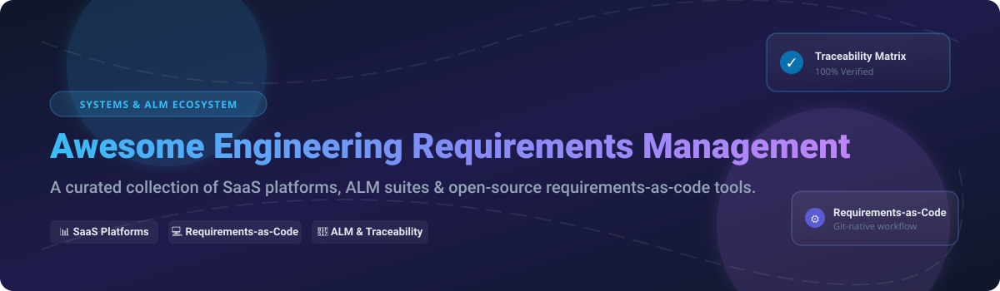

# 🚀 Awesome Engineering Requirements Management

  

  
  
  
  
  
  

## 📌 Top Requirements Management (Engineering) Platforms Ecosystem
**Curated List of SaaS Products & Open-Source GitHub Projects**  
*Focused on Systems & Software Requirements, Traceability, Baselines, ALM Integration & Regulated Engineering Workflows*  
**Last updated: September 2026**

---

## 💡 About & Overview
This repository tracks notable **SaaS platforms**, enterprise **Application Lifecycle Management (ALM)** suites, and **open-source projects** for **Requirements Management** in systems and software engineering. These tools empower engineering teams to capture, structure, baseline, review, test, and trace requirements across complex product lifecycles—ensuring strict compliance with ISO 26262, DO-178C, IEC 62304, and INCOSE standards.

Whether you are looking for enterprise safety-critical ALM suites (IBM DOORS Next, Jama Connect, Polarion) or Git-native **requirements-as-code** tools (Doorstop, StrictDoc, Sphinx-Needs), this list provides complete pricing, evaluation limits, market size, and open-source star metrics.

---

## 📑 Table of Contents
- [🏢 Market Overview & Size](#-market-overview--size)
- [☁️ SaaS / Hosted Platforms](#%EF%B8%8F-saas--hosted-platforms)
- [💻 Open-Source GitHub Projects](#-open-source-github-projects)
- [🤝 How to Contribute](#-how-to-contribute)
- [💖 Support & Sponsorship](#-support--sponsorship)
- [📈 Star History](#-star-history)
- [⚠️ Disclaimer](#%EF%B8%8F-disclaimer)

---

## 🏢 Market Overview & Size
> 💡 **Market Size & Structure**: The global **Requirements Management & ALM Software Market** is estimated at **$4.2 Billion (2026)** and is projected to reach **$7.8 Billion by 2032** growing at a CAGR of 10.8%.  
> The sector is **moderately fragmented**, dominated at the top tier by enterprise conglomerates (Siemens, PTC, IBM, Microsoft) in safety-critical regulated engineering, while rapidly expanding at the mid-market with modern SaaS platforms (Jama Connect, Visure) and Git-native requirements-as-code tools.

---

## ☁️ SaaS / Hosted Platforms

| Product | Enterprise Scale / Company Revenue / Valuation | Starting Pricing | Free Tier / Trial Limits | Key Features & Focus |
| :--- | :--- | :--- | :--- | :--- |
| **[Azure DevOps](https://azure.microsoft.com/services/devops/)** | **$245B+ Revenue** (Microsoft Parent) | **$6/user/month** (Basic Plan) | **First 5 users FREE forever**; 1,800 free CI/CD build minutes/month | Work item & requirements tracking within Microsoft's DevOps suite. |
| **[IBM Engineering Requirements Management DOORS Next](https://www.ibm.com/)** | **$62B+ Revenue** (IBM Parent) | **$1,640/user/year** (Standard SaaS License) | **30-day Free Trial** (Full functional access upon sales request) | Industry-standard requirements management for complex, safety-critical systems engineering. |
| **[Polarion ALM (Siemens)](https://polarion.plm.automation.siemens.com/)** | **$85B+ Revenue** (Siemens AG Parent) | **$150/user/month** (Approx starting Enterprise tier) | **30-day Free Cloud Trial** (Limited to 5 test user seats) | Unified ALM covering requirements, quality, and compliance for systems engineering. |
| **[codebeamer (PTC)](https://www.ptc.com/)** | **$2.1B+ Revenue** (PTC Parent) | **$120/user/month** (Enterprise ALM tier) | **30-day Free Trial** (Sandbox environment available on request) | Modern ALM with integrated requirements, risk management, and regulatory workflows. |
| **[Helix ALM (Perforce)](https://www.perforce.com/)** | **$500M+ Revenue** (Perforce Private Valuation ~$3B+) | **$89/user/month** (Helix RM module) | **30-day Free Trial** (Up to 5 users, full RM module features) | Requirements, test, and issue management suite with end-to-end traceability. |
| **[Jama Connect](https://www.jamasoftware.com/)** | **$100M+ Revenue** (Acquired by Francisco Partners ~$1B) | **$100/user/month** (Enterprise minimum license base) | **30-day Free Trial** (Guided interactive environment) | Collaborative requirements & test management focused on live traceability & reviews. |
| **[Visure Requirements](https://visuresolutions.com/)** | **$20M+ Revenue** (Private Regulated Tech Leader) | **$95/user/month** (Standard Professional tier) | **30-day Free Trial** (Includes AI requirements assistant demo) | Requirements ALM platform tailored for safety-critical (DO-178C, ISO 26262) industries. |
| **[Modern Requirements4DevOps](https://www.modernrequirements.com/)** | **$15M+ Revenue** (Private Specialist) | **$45/user/month** (Azure DevOps Add-on license) | **30-day Free Trial** (Full integration inside Azure DevOps project) | Requirements authoring, diagramming & baselining embedded inside Azure DevOps. |
| **[Valispace](https://www.valispace.com/)** | **$10M+ Revenue** (Acquired by Altium / Renesas) | **$70/user/month** (Engineer SaaS Tier) | **14-day Free Trial** (Full access for up to 3 team projects) | MBSE-oriented hardware collaboration platform connecting requirements with system parameters. |
| **[ReqView](https://www.reqview.com/)** | **$5M+ Revenue** (Bootstrapped / Private Specialist) | **$390/user/year** (~$32.50/mo Standard Plan) | **FREE Plan forever** (Limited to 1 document with up to 100 requirements) | Lightweight, offline-first document-oriented requirements management tool. |

---

## 💻 Open-Source GitHub Projects

Below are open-source requirements management tools, requirements-as-code frameworks, and open ALM suites sorted by GitHub stargazers count:

- 🌟 **[Doorstop](https://github.com/doorstop-dev/doorstop)**   
  *Requirements management using version-controlled text files (YAML/Markdown) with command-line validation and automated traceability matrix generation.*

- 🌟 **[StrictDoc](https://github.com/strictdoc-project/strictdoc)**   
  *Open-source requirements-as-code and technical documentation tool—human-readable SDoc/Markdown source with generated web views, traceability, and Git-friendly workflows.*

- 🌟 **[Eclipse Capella](https://github.com/eclipse-capella/capella)**   
  *Open-source Model-Based Systems Engineering (MBSE) environment for architectural design, requirement allocation, and system specification.*

- 🌟 **[Sphinx-Needs](https://github.com/useblocks/sphinx-needs)**   
  *Extension for Sphinx that embeds linked "need" objects (requirements, specs, test cases) into Python and technical documentation-as-code workflows.*

- 🌟 **[rmtoo](https://github.com/florath/rmtoo)**   
  *Free and open-source requirements management tool that processes text-file requirements to produce dependency graphs, matrices, HTML, PDF, and quality analytics.*

- 🌟 **[reqT](https://github.com/reqT/reqT)**   
  *Open-source requirements engineering tool and modeling language (reqT-lang in Scala) for specifying, analyzing, visualizing, and automating requirements.*

- 🌟 **[Tuleap Community Edition](https://github.com/Enalean/tuleap)**   
  *Open-source application lifecycle management suite with configurable trackers for requirements engineering, issue tracking, and agile workflows.*

---

## 🤝 How to Contribute
1. 🍴 Fork this repository.
2. 📝 Add or update entries in `README.md` (maintain tabular structure for SaaS or Stars_Badges for open source).
3. 🔍 Ensure descriptions are factual, verified, and include links to official repositories or web pages.
4. 🚀 Submit a Pull Request with a clear explanation of your changes.

Check out our curated meta-list at **[Awesome-Awesome-Awesome](https://github.com/ishandutta2007/Awesome-Awesome-Awesome)** for more engineering repositories!

---

## 💖 Support & Sponsorship

If you find this repository helpful for your engineering team, systems architecture research, or software selection process, please consider supporting the project:

- ⭐ **Star** this repository to increase its visibility.
- 🔄 **Fork** and contribute new tools or update pricing data.
- 📢 **Share** with colleagues and engineering communities.
- ☕ **Buy me a coffee / Sponsor**: If you'd like to support ongoing maintenance and research, visit the **[GitHub Sponsor Dashboard](https://github.com/sponsors/ishandutta2007)**.

---

## 📈 Star History

---

## ⚠️ Disclaimer
- This is a **community-curated** list — not exhaustive and not an endorsement.
- Requirements management in safety-critical and regulated industries (aerospace, automotive, medical devices, defense) carries strict certification obligations. Open-source tools may require additional process controls, qualification, and verification.

---
**Made with ❤️ for systems engineers, software architects, product managers, and open-source advocates.**
